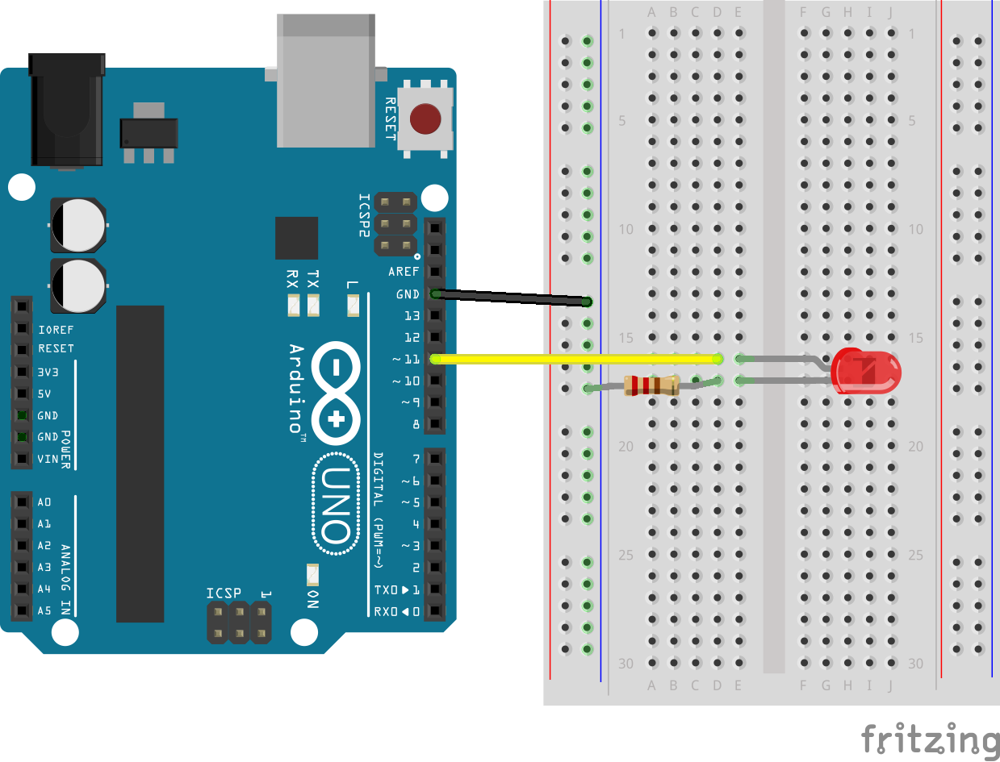

<!--remove-start-->
# Led Analog

Run with:
```bash
node eg/led-analog.js
```
<!--remove-end-->

```javascript
//
// Demonstrates using some of the LED analog (PWM) commands together
//

var five = require("johnny-five");

five.Board().on("ready", function() {

  // Defaults to pin 11 (must be PWM)
  var led = new five.Led(process.argv[2] || 11);

  // Pulse the LED every half second
  console.log("led.pulse(500)");
  led.pulse(500);

  // fadeIn( duration ) , fadeOut( duration )
  // Wait 3 seconds, then fade the LED to full brightness
  // over 5 second duration
  this.wait(3000, function() {
    // We have to call stop() or it will keep pulsing
    led.stop().off();

    console.log("led.fadeIn(5000)");
    led.fadeIn(5000);
  });

  // fade(value, duration[, callback])
  // 
  // Fade to analog brightness of 10 over 4 seconds
  // 
  // Note, this is 10 seconds from programm execution,
  // not 10 seconds from the previous wait call.
  // You would need to nest the waits or use something
  // like `temporal` to be more precise in sequencing.
  this.wait(10000, function() {
    led.stop(); // resetting in case previous animation running

    console.log("led.fade(10,4000,callback)");
    led.fade(10, 4000, function() {
      console.log("fade finished");
    });
  });

  // brightness(value)
  // 
  // Set analog brightness to 125
  this.wait(20000, function() {
    console.log("led.brightness(125)");
    led.brightness(125);
  });


});

```


## Breadboard/Illustration



[docs/breadboard/led-analog.fzz](breadboard/led-analog.fzz)


<!--remove-start-->
## License
Copyright (c) 2012, 2013, 2014 Rick Waldron <waldron.rick@gmail.com>
Licensed under the MIT license.
Copyright (c) 2014, 2015 The Johnny-Five Contributors
Licensed under the MIT license.
<!--remove-end-->
