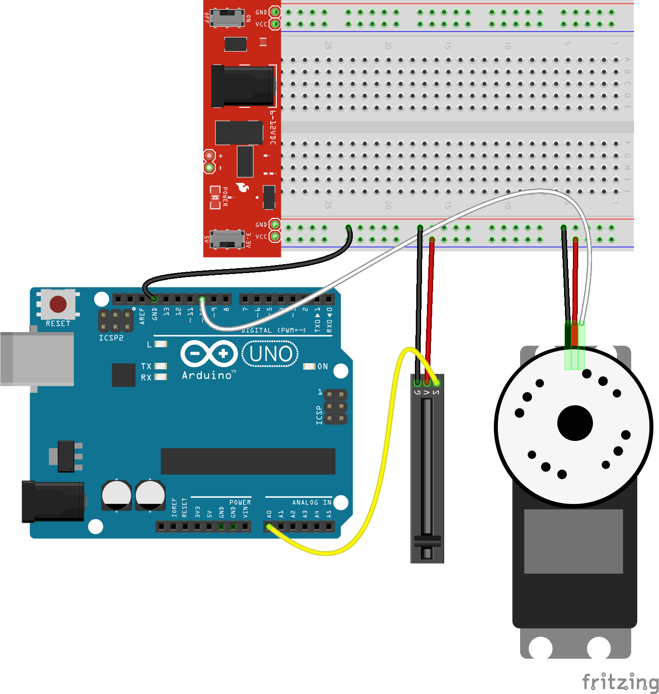

# Servo Slider

Run with:
```bash
node eg/servo-slider.js
```


```javascript
var five = require("johnny-five"),
  board, slider, servo, range;

board = new five.Board();

board.on("ready", function() {

  // The Servo class defaults to the standard 180°,
  // This example program is intended to run with a
  // 90° digital servo.
  range = [0, 90];

  // Create a new servo instance on PWM 10, w/ a 0-90° range
  servo = new five.Servo({
    pin: process.argv[2] || 10,
    range: range
  });

  // °
  slider = new five.Sensor({
    pin: "A0",
    freq: 50
  });


  // Scale the slider's value to fit in the servo's
  // movement range. When the slider position changes
  // update the servo's position
  slider.scale(range).on("slide", function() {

    servo.to(Math.floor(this.value));

  });
});

```


## Breadboard/Illustration



[docs/breadboard/servo-slider.fzz](breadboard/servo-slider.fzz)


## License
Copyright (c) 2012, 2013, 2014 Rick Waldron <waldron.rick@gmail.com>
Licensed under the MIT license.
Copyright (c) 2014, 2015 The Johnny-Five Contributors
Licensed under the MIT license.
